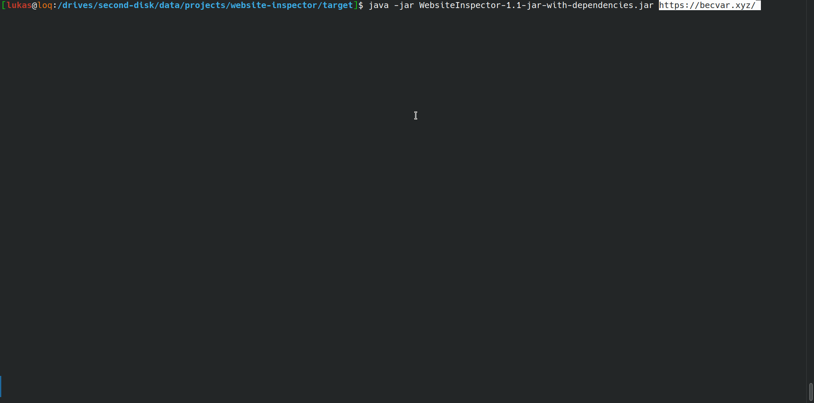

# Website Inspector
The Website inspector is CLI-Tool for get information about web applications and scanning vulnerabilities.

## Preview


## Features
- Scans websites for information about the server, CMS, and more
- Scans robots.txt and sitemap.xml files for information about the website
- Scans websites for directory listings
- Scans websites for subdomains

## Usage example
```
java -jar WebsiteInspector.jar https://example.com
```

## License
This software is licensed under the [MIT license](https://github.com/lukasbecvar/website-inspector/blob/main/LICENSE).
